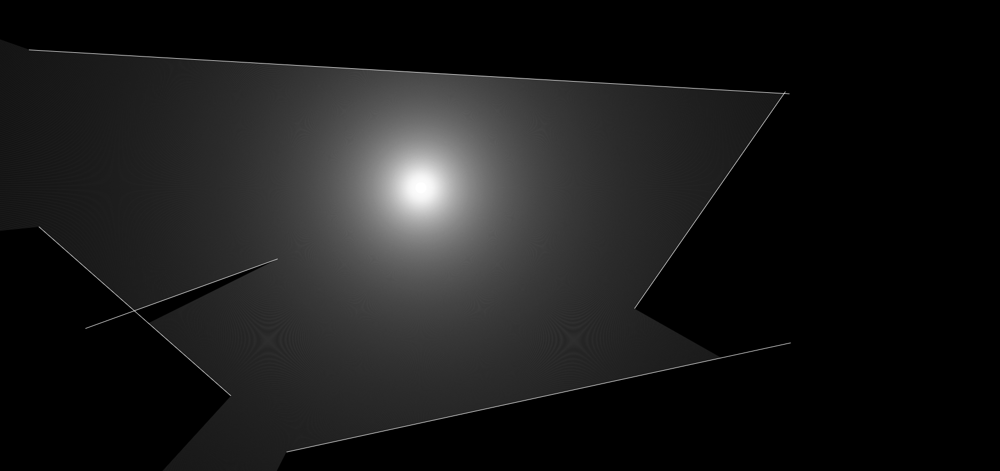

# Raycasting
Raycasting technique is used to render the screen contents by projecting the array of rays and getting the intersection point of it.
 
 

<h3 style="text-align:center;">Made with ♥️ by Manoj Pandian</h3>
